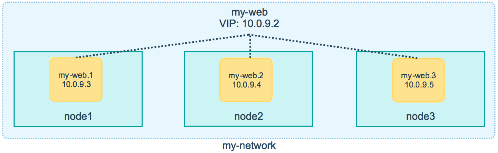
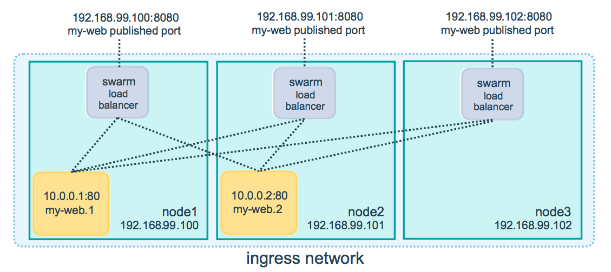

### Overlay Network

A new networking driver made available by Swarm  
This allows for intra node communication (bridge network across the swarm)  
IPsec (AES) can be enabled for the connection (disabled by default)

 > [!note]
 > The `docker_gwbridge` (bridge network) and `ingress` (overlay network) is created automatically by docker when swarm is enabled 

````bash
# Create a overlay network
docker network create --driver overlay <network-name>
````

---

### Routing Mesh

Ingress network that allows packets for an service to reach its proper task  
Available across call the nodes in the swarm  
Uses IPVS (IP Virtual Server) present in the Linux Kernel to enable this feature  
It performs load balancing for the swarm services across their tasks

Container-to-Container communication over Overlay network uses VIP (Virtual IP)



External traffic incoming to the swarm can hit any of node as all nodes are listening on all the ports required by the running services



There is an load balancer that is present on the external IP address of each node  
This is a stateless load balancer (If session needs to be maintained another stateful load balancer will need to be used)  
It is an Layer 3 (TCP) Load Balancer not Layer 4 (DNS)

Nginx or HAProxy Load Balancer can be deployed to overcome these issues  
Docker Enterprise also comes with an Layer 4 Load Balancer