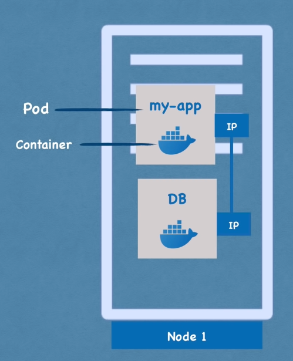

### Pods

Smallest unit of K8s. It is an abstraction over containers

Pod is meant to mostly run a single container  
But multiple containers can be run in run in a single Pod (used if the main container has an helper service that is tightly coupled with the main container)

Each Pod in K8s is assigned its own Virtual Private IP Address  
If an container crashes and its restarted it will be assigned a new IP Address

---

### Service

It is a Permanent Private IP Address that can be assigned to each Pod  
The lifecycle of Pod and Container are not connected (If Pod restarts the IP will still remain the same)

Types of Services : [Kubernetes Services](../Kubernetes%20Components/Kubernetes%20Services.md)

---

### Config Map & Secrets

Config Map is used to store the external configuration of our applications (Environment Variables)  
The config has to be connected/ applied to an Pod

**Credentials** and **Secrets** should **not be** stored in **Config Map** (Use Secrets instead)  
Value of data stored in Secret has to be **base64** encoded

 > [!important]
 > * Storing the data in secret component does not automatically make it secure
 > * There are build-in features like encryption (default not enabled) that need to be used

The data from Config Map and Secrets can be accessed in Pod like a Environment Variable or Configuration File

---

### Controller

Used for creating/ updating pods and other objects (Rules for managing K8s objects)  
Multiple Types : [Deployment](../Kubernetes%20Components/Kubernetes%20Deployments.md), ReplicaSet, DaemonSet, StatefulSet, Cron, CronJob

<u>Deployment</u>
  
It is an type of Controller. Blueprint of actions to be performed on the Pods  
It is an abstraction over the Pods which makes it move convenient to talk with the Pods
Provides the ability to create replicas of the Pods  
DBs cannot be replicated using Deployments (As DBs are stateful)

<u>StatefulSet</u>
  
It is used when the state of the Pod needs to be maintained across multiple replicas of the Pod  
Along with replication provides additional mechanisms to maintain data consistency
