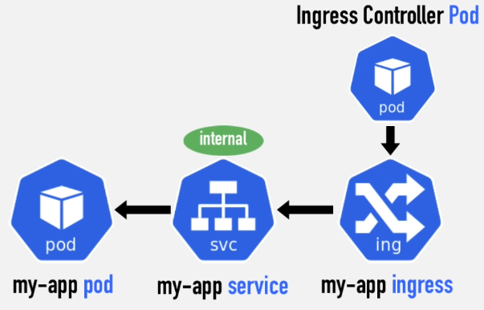

Allows to route outside connections to Pods based on URLs (similar to LoadBalancer)  
It is like a smart router that routes the incoming traffic to its corresponding app

Ingress is not an service its only a configuration (on its own does nothing)  
Ingress Controller (an Pod that can redirect the traffic based on the ingress rules) has to be added to the cluster  
Ingress Controller is the entry point onto the cluster

With Ingress a Internal Service (ClusterIP) also has to be created  
Using Ingress, IP Address and Ports are not exposed like in [LoadBalancer](Kubernetes%20Services.md#load-balancer)



When using K8s in the cloud there will be a Cloud Load Balancer that acts as the entry point which forwards the traffic to the Ingress Controller  
When used on Bare Metal we need to setup an Proxy Server (Device with Public IP Address) that acts as the entry point

When creating Ingress an Ingress Class also needs to be created  
Default Backend is the path the requests are going to be sent to when an path is not found in the defined routes

````bash
# View all Ingress
kubectl get ingress -n kubernetes-dashboard

# View metadata about the Ingress
kubectl describe ingress dashboard-ingress -n kubernetes-dashboard
````

The Ingress object has to be in the same namespace as the app that needs to be accessed from external network

---

**<u>References</u>**:

* [Ingress | Kubernetes](https://kubernetes.io/docs/concepts/services-networking/ingress/)
