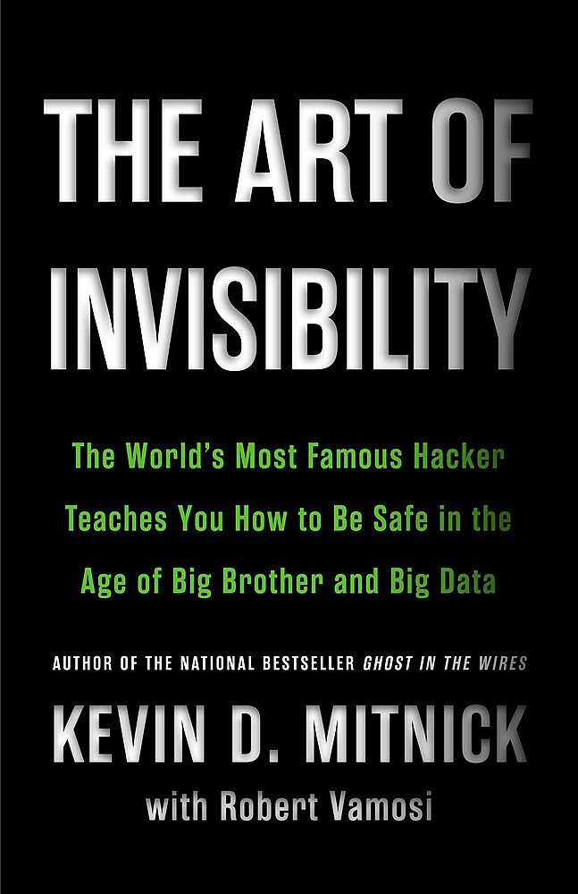
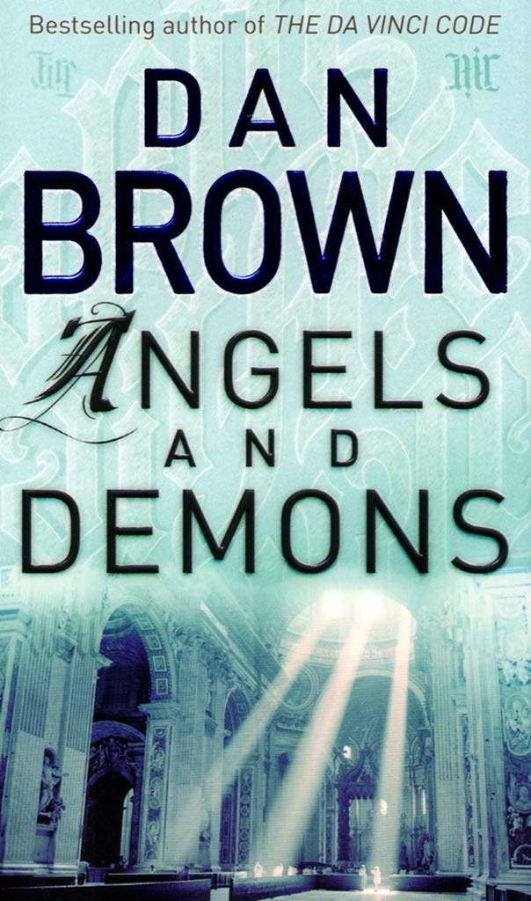
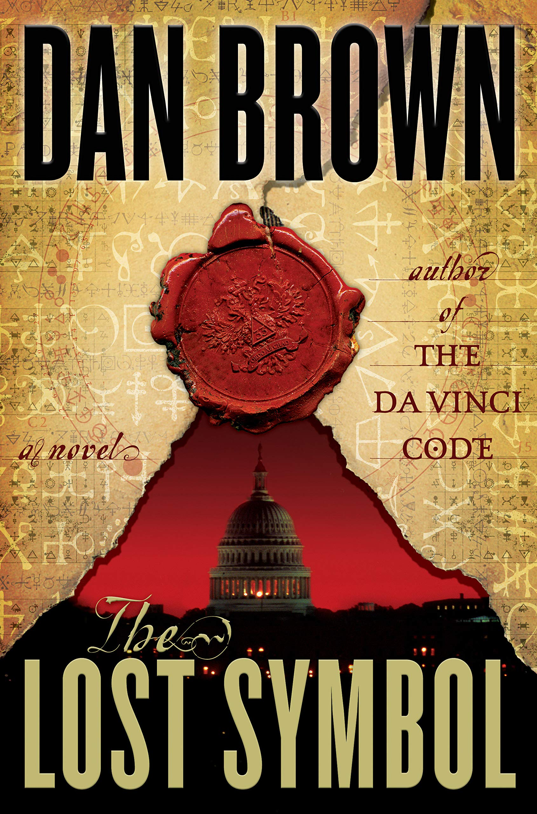
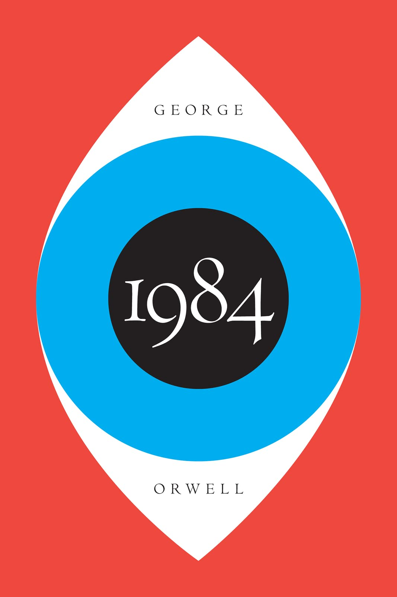
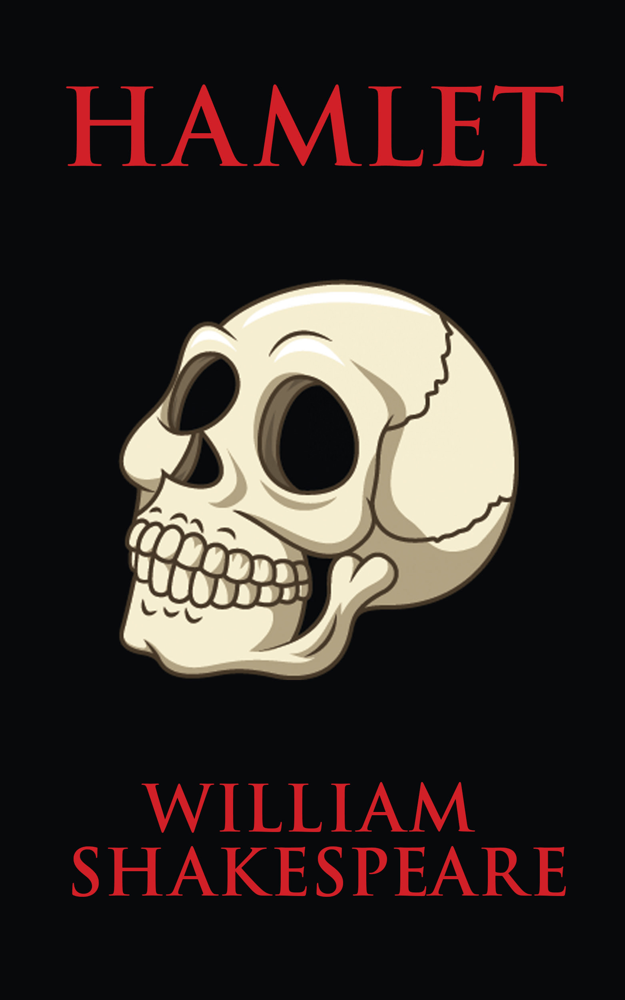

| No. |                                           Cover                                            |                 Name                 |              Author               |                      Genre                      |                                        Goodreads                                        |   Status   |
|:---:|:------------------------------------------------------------------------------------------:|:------------------------------------:|:---------------------------------:|:-----------------------------------------------:|:---------------------------------------------------------------------------------------:|:----------:|
|     | |They Do It With Mirrors |Agatha Christie|Fiction, Mystery, Crime, Triller|        [Link](https://www.goodreads.com/book/show/68930.They_Do_It_With_Mirrors)        | #Completed |
|     | |Kafka on the Shore |         Hauruki Murakami          |        Fiction, Magical-Realism, Fantasy        |[Link](https://www.goodreads.com/book/show/4929.Kafka_on_the_Shore)| #Completed |
|     ||The Art of Invisibility|           Kevin Mitnick           |             Non-Fiction, Technology             |[Link](https://www.goodreads.com/book/show/30363785-the-art-of-invisibility)| #Completed |
|     ||The Hitchhiker's Guide to the Galaxy|           Douglas Adams           |        Fiction, Humor, Fantasy, Classics        | [Link](https://www.goodreads.com/book/show/386162.The_Hitchhiker_s_Guide_to_the_Galaxy) | #Completed |
|     |                                              |            The Alchemist             |           Paulo Coelho            |      Fiction, Fantasy, Adventure, Classics      |           [Link](https://www.goodreads.com/book/show/18144590-the-alchemist)            | #Completed |
|     |                                |         Crime and Punishment         |         Fyodor Dostoevsky         |     Fiction, Crime, Physiological, Classics     |          [Link](https://www.goodreads.com/book/show/7144.Crime_and_Punishment)          | #Completed |
|     |                                |      And Then There Where None       |          Agatha Christie          |        Fiction, Mystery, Crime, Thriller        |       [Link](https://www.goodreads.com/book/show/16299.And_Then_There_Were_None)        | #Completed |
|     |                                          |          The Da Vinci Code           |             Dan Brown             |           Fiction, Mystery, Thriller            |            [Link](https://www.goodreads.com/book/show/968.The_Da_Vinci_Code)            | #Completed |
|     |                                      |          Angels and Demons           |             Dan Brown             |        Fiction, Mystery, Thriller, Crime        |              [Link](https://www.goodreads.com/book/show/960.Angels_Demons)              | #Completed |
|     |                                          |           The Lost Symbol            |             Dan Brown             |        Fiction, Mystery, Thriller, Crime        |           [Link](https://www.goodreads.com/book/show/6411961-the-lost-symbol)           | #Completed |
|     |                                                                |                 1984                 |           George Orwell           | Fiction, Politics, Fantasy, Dystopian, Classics |                [Link](https://www.goodreads.com/book/show/61439040-1984)                | #Completed |
|     |                                                           |                Hamlet                |        William Shakespeare        |         Fiction, Drama, Play, Classics          |                 [Link](https://www.goodreads.com/book/show/1420.Hamlet)                 | #Completed |
|     |                                                |             The Stranger             |           Albert Camus            |        Fiction, Philosophical, Classics         |             [Link](https://www.goodreads.com/book/show/49552.The_Stranger)              | #Completed |
|     |                                      |     The Divine Comedy (Inferno)      |          Dante Alighieri          |  Fiction, Poetry, Fantasy, Religion, Classics   |           [Link](https://www.goodreads.com/book/show/6656.The_Divine_Comedy)            | #Completed |
|     |                                                | [Why We Sleep](Why%20We%20Sleep.md)  |          Matthew Walker           |    Non-Fiction, Science, Health, Psychology     |            [Link](https://www.goodreads.com/book/show/34466963-why-we-sleep)            | #Completed |
|     |                                                    |              Siddhartha              |           Herman Hesse            |        Fiction, Philosophical, Classics         |              [Link](https://www.goodreads.com/book/show/52036.Siddhartha)               | #Completed |
|     |                                            |            Fahrenheit 451            |           Ray Bradbury            |      Fiction, Dystopian, Fantasy, Classics      |           [Link](https://www.goodreads.com/book/show/56302573-farenheit-451)            | #Completed |
|     |                  |     The Murder of Roger Ackroyd      |          Agatha Christie          |        Fiction, Mystery, Crime, Thriller        |      [Link](https://www.goodreads.com/book/show/16328.The_Murder_of_Roger_Ackroyd)      | #Completed |
|     |                                                        |               Zero Day               |          David Baldacci           |        Fiction, Triller, Mystery, Crime         |              [Link](https://www.goodreads.com/book/show/11007587-zero-day)              | #Completed |
|     |                          |       Man's Search for Meaning       |         Viktor E. Frankl          |     Non-Fiction, History, Memoir, Biography     |        [Link](https://www.goodreads.com/book/show/4069.Man_s_Search_for_Meaning)        | #Completed |
|     |                                                            |         [Ikigai](Ikigai.md)          | Francesc Miralles & Hector Garcia |   Non-Fiction, Self Help, Health, Psychology    |             [Link](https://www.goodreads.com/en/book/show/40534545-ikigai)              |  #Reading  |

[Various Lists](../Various%20Lists.md)
