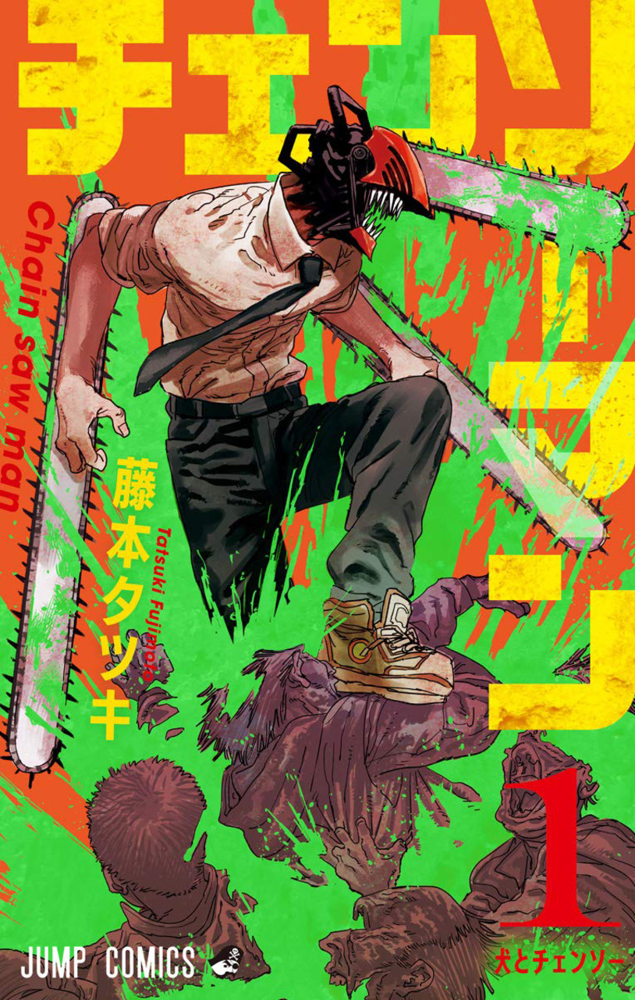
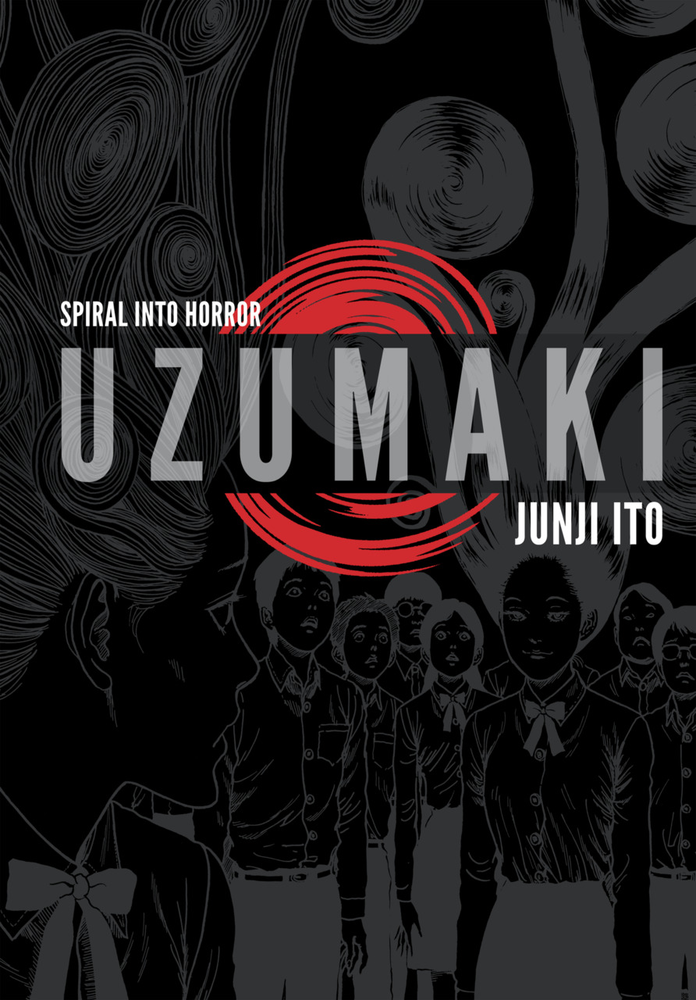

| No. |                         Cover                          |       Name        |      Author      |                    Genre                     |                              MyAnimeList                               |   Status   |
|:---:|:------------------------------------------------------:|:-----------------:|:----------------:|:--------------------------------------------:|:----------------------------------------------------------------------:|:----------:|
|     |            |   Chainsaw Man    | Taksuki Fujimoto |        Fiction, Action, Dark Fantasy         |       [Link](https://myanimelist.net/manga/116778/Chainsaw_Man)        |  #Ongoing  |
|     |                      |      Uzumaki      |    Junji Ito     | Fiction, Horror, Supernatural, Psychological |           [Link](https://myanimelist.net/manga/436/Uzumaki)            | #Completed |
|     |                         |       Tomie       |    Junji Ito     |        Fiction, Horror, Supernatural         |            [Link](https://myanimelist.net/manga/912/Tomie)             | #Completed |
|     |                          |      BLAME!       |  Nihei Tsutomu   |    Fiction, Action, Psychological, Sci-Fi    |            [Link](https://myanimelist.net/manga/149/Blame)             | #Completed |
|     |                  |     Liar Game     | Kaitani Shinobu  |        Fiction, Psychological, Drama         |          [Link](https://myanimelist.net/manga/1649/Liar_Game)          | #Completed |
|     |                  |     Happiness     |   Shūzō Oshimi   |     Fiction, Supernatural, Dark Fantasy      |         [Link](https://myanimelist.net/manga/85173/Happiness)          | #Completed |
|     |  | 20th Century Boys |  Naoki Urasawa   |   Fiction, Sci-Fi, Thriller, Psychological   |       [Link](https://myanimelist.net/manga/3/20th_Century_Boys)        | #Completed |
|     |                |    Dorohedoro     |   Hayashida Q.   |           Fiction, Action, Fantasy           |         [Link](https://myanimelist.net/manga/1133/Dorohedoro)          | #Completed |
|     |              |    The Sandman    |   Neil Gaiman    |        Fiction, Dark Fantasy, Horror         | [Link](https://www.goodreads.com/book/show/23753.The_Absolute_Sandman) | #Completed |
|     |              |    The Horizon    |  Ji-Hoon Jeong   |          Fiction, Adventure, Drama           |        [Link](https://myanimelist.net/manga/125036/The_Horizon)        | #Completed | 

[Various Lists](../Various%20Lists.md)