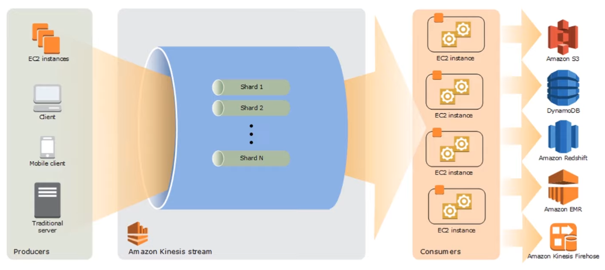

---
tags:
- aws
- cloud
- streaming
title: AWS Kinesis
---

It makes it easy to collect, process and analyze real-time streaming data so we can get timely insights or react quickly to new information

[Kinesis Key Terms](kinesis-key-terms.md)

### Advantages

Real-time  
Fully managed (No need to manage any infrastructure)  
Scalable (Can handle large amount of streaming data)

### Features of Kinesis

Kinesis Data Streams (Ingest and store streaming data for processing)  
Kinesis Data Firehose (Prepare and load data continuously to destination)  
Kinesis Data Analytics (Query and analyze streaming data. Captures data from firehose and data streams)  
Kinesis Video Streams (Ingest Videos into AWS and use to for ML)

---

[AWS](../../aws.md)