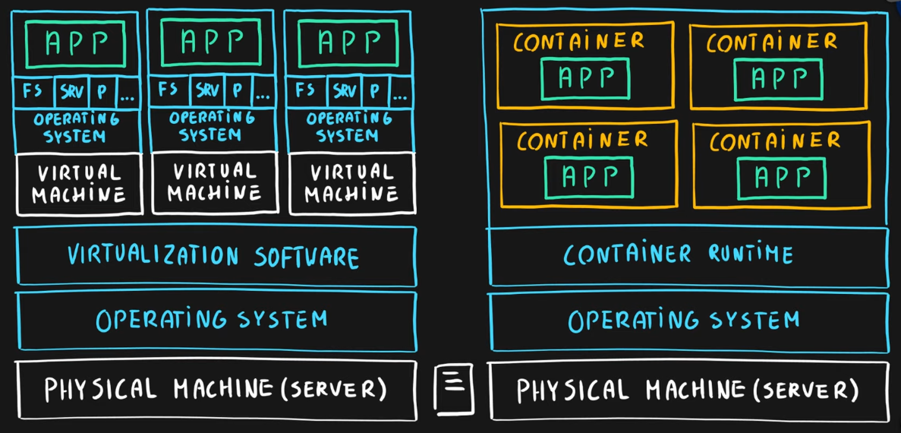

---
tags:
- azure
- cloud
- compute
title: Azure Compute Services
---

### Table of Content

* [Azure Virtual Machine](azure-virtual-machine.md)
* [Azure Container Instance (ACI)](azure-container-instance-aci.md)
* [Azure Kubernetes Service (AKS)](azure-kubernetes-service-aks.md)
  - [Kubernetes](../../../software-engineering/devops/kubernetes/kubernetes.md)
  - [Health Checks](health-checks.md)
* **Azure App Service**
  - [Azure Service Plan](azure-service-plan.md)
  - [Azure Web App](azure-web-app.md)
  - [Azure Function App](azure-function-app.md)

---

### Virtualization

Emulation of physical hardware  
Allows to have different virtual hardware configurations based on machine/app  
Allows to install different OS per machine/app  
Since each virtual machine is independent of the other it has its own FS, ports, services, storage, etc.

### Azure Service Fabric

Microsoft's native container orchestrator similar to [Kubernetes](../../../software-engineering/devops/kubernetes/kubernetes.md)  
It is a distributed systems platform that allows us to run stateful applications

### Azure Batch

Allows running large-scale parallel and High-Performance Computing (HPC) workloads on nodes (Virtual Machines) in a cluster

---

[Azure](../azure.md)