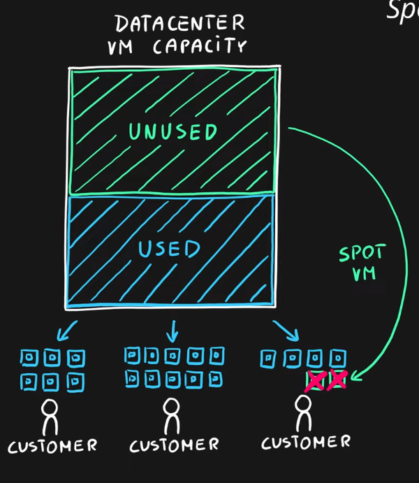

---
tags:
- azure
- cloud
- cost
title: Cost Reducing Approaches
---

### Reservations

Booking an capacity of the service in advance for using for an long period of time
Suitable when we have very consist service usage (Autoscaling, etc. is not required)

Types:

* **Reserved Instances**: Azure Virtual Machines
* **Reserved Capacity**: DBs, [Azure Storage Services](../azure-storage-services/azure-storage-services.md), [Databricks Clusters](../../../data-analytics/databricks/databricks-clusters.md), etc.
* **Software Plans**: Red Hat, SUSE Linux, etc.

Reservations are made for 1 or 3 years

### Spot Pricing for VM

Buy VM for Azure as normal but it's an Spot VM  
Microsoft can take away this capacity at anytime  
Can set maximum price after purchase (If price above max price VM is evicted)  
Best of interruptible workload ([Batch Processing](../azure-messaging-services/batch-processing.md), Non critical processing, etc.)

### Hybrid Use Benefit

Allows to use existing on premise licenses for services on the cloud  
When moving an on-premises Device to the cloud isn't of paying again for the OS use the already existing one

---

[Azure](../azure.md)