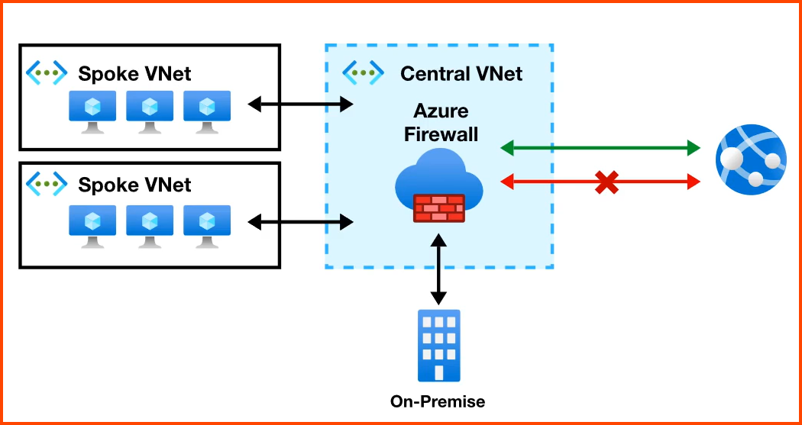

---
tags:
- azure
- cloud
- security
- network
title: Azure Firewall
---

It is an service that allows to monitor incoming and outgoing traffic  
It is PaaS (sometimes called Firewall as a Service)  

Has high availability and high scalability  
Supports FQDN (Fully Qualified Domain Name) filtering  
Integrated with [Azure Monitor](../azure-other-services/azure-monitor/azure-monitor.md) for logging and analytics

Azure Firewall is generally created in its own VNet  
Other VNet are configured to pass through this central VNet