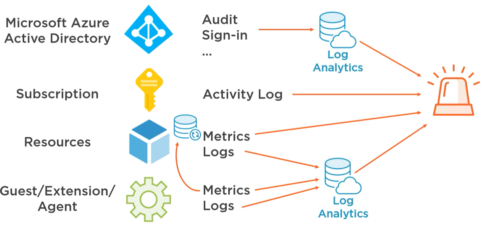

---
tags:
- azure
- cloud
- alert
- metric
title: Azure Alerts
---

Proactively notify the user about any issue

**Alert Rule**: Condition to send alert (optionally can configure a Action Group)  
**Action Group**: A set of actions to perform  
**Action Rule**: Allows to conditionally trigger or suppress alerts

Administrative Category included information related to the creation, updating and deletion of resource

### Alert Signal Sources

Subscription Activity Log: Health and Auto scale Events. Has 90 days retention for information  
Azure Monitor Metrics: Native time-series database. 90 days retention  
Log Analytics Log Search: Up to 2 years of retention

Alerts are generated instantaneously when using data from Azure Monitor

Leaving **Activity Log** & **Metrics from Resources** all other data needs to be sent to Log Analytics before it can be used as a Signal

Services that support auto scaling make use of metrics generated by Azure Monitor to decide when to scale

---

[Azure](../../azure.md)