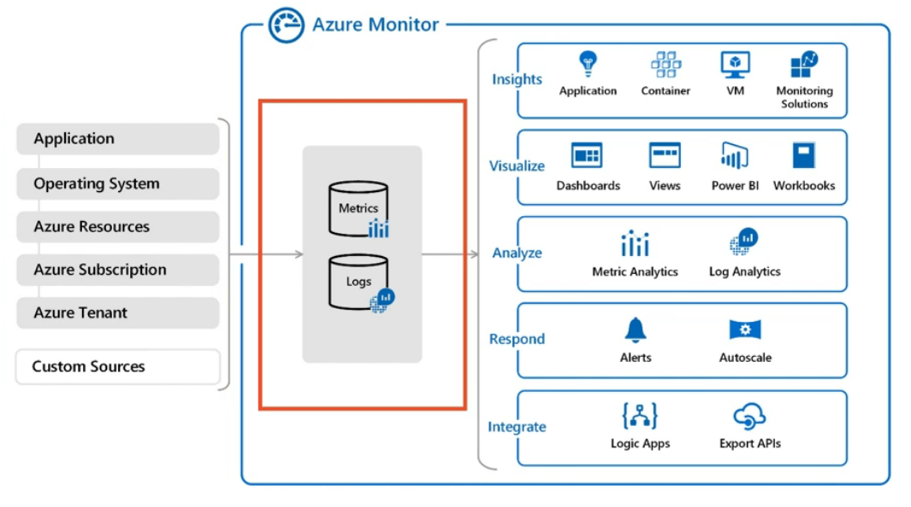

---
tags:
- azure
- cloud
- monitor
- alert
- metric
title: Azure Monitor
---

It is a comprehensive monitoring solution for collection and analyzing telemetry data  
It uses Logs and Metrics collected from the resources for providing insights  

For some services like SQL server we need to manually enable auditing and monitoring before Azure Monitor can collect data  
For VM we need to install Log Analytics Agent for collecting its data

[Azure Alerts](azure-alerts.md) can be configured to be sent when certain conditions are satisfied  
<u>Azure Monitor Insights</u> can be used to view KPIs of resources  

[Azure Monitor overview - Azure Monitor | Microsoft Learn](https://learn.microsoft.com/en-us/azure/azure-monitor/overview)

---

[Azure](../../azure.md)