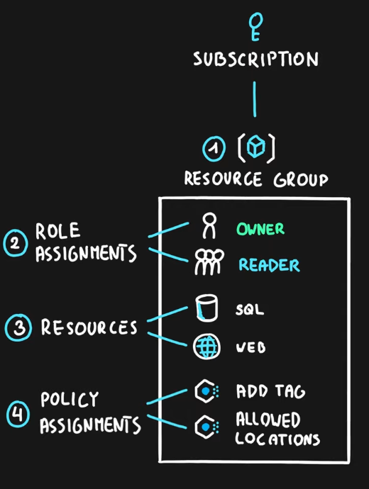

---
tags:
- azure
- cloud
- policy
- security
title: Azure Blueprints
---

A blueprint is an guide, a pattern or a design for making something  

**Blueprint Definition**: A collection of Azure Components (Resource Groups, Role Assignments, Resources, Policy Assignments) that can all be deployed with the click of an button. Describes what the blueprint should do  
**Blueprint Assignment** : Deploy all the resources in the Blueprint

It is used to automate the process of resource deployment in Azure  
The various components that can be used in Blueprints are called as Artifacts

Azure Blueprints are backed by [Azure Cosmos DB](../azure-datastore-services/azure-cosmos-db/azure-cosmos-db.md) and the blueprint objects are replicated to multiple regions  

Nearly everything deployed using Azure Blueprints can be deployed using [ARM Templates](../azure-other-services/arm-templates.md) 
For resources deployed using Azure Blueprints the relation between the Blueprint object and the deployed resource is maintained 

[How is Azure Blue Prints different from Resource Manager Templates - Microsoft Q&A](https://learn.microsoft.com/en-us/answers/questions/26851/how-is-azure-blue-prints-different-from-resource-m)