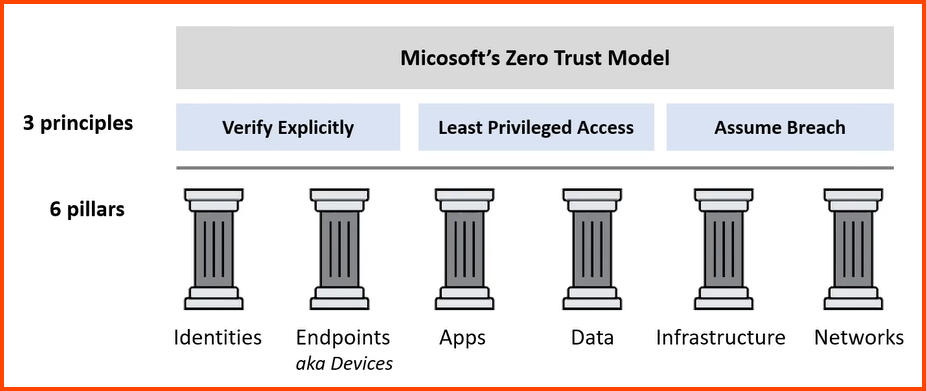

---
tags:
- security
- cloud
title: Zero-Trust Model
---

### Zero-Trust Concepts

Trust nothing and verify everything  
Under the zero-trust model verification is required for every device, user and transaction within the network regardless of its origin

#### Control Plane
The framework responsible for defining, managing and enforcing the policies related to user and system access with an organization

**Adaptive Identity**  
Real-time identity verification that takes into account user behavior, device, location and other factors

**Threat Scope Reduction**  
Limit the users access to only what they need for their work tasks  
Minimizes blast radius

**Policy-driven Access Control**  
Developing managing and enforcing user access policies based on their roles  

**Secured Zones**  
Isolated environments within a network that are designed to hose sensitive data

#### Data Plane
Ensures that the policies and procedures are properly executed

**Subject/System**  
Individual or entity trying to gain access

**Policy Engine**  
Cross reference the access request with the pre-defined policies

**Policy Administrator**  
Used to establish and manage the access policies

**Policy Enforcement Point**  
Based on the subject/system and the evaluation of the policy engine the decision is made to grant or restrict access  
Acts as a gatekeeper to secure regions in the system

---
### Microsoft Zero-trust Model

6 Pillars: IDEA-IN  

Verify Explicitly: AuthN (Authentication) + AuthZ (Authorization)  
Least Privilege: JIT & JeP  
Assume Breach: Segment Network, Encryption, Detect Threats

**JIT (Just-in-time)**: Given access to a resource only during the time when it is needed  
**JeP (Just enough Privilege)**: Give access to only the specified access (API calls)

---
### Defense in Depth

Data: Encryption  
Application: Secure & free of vulnerability  
Compute: Access to VM  
Network: Limit communication using segmentation & access control  
Perimeter: DDoS Protection  
Identity & Access: Controlling access to Infrastructure  
Physical: Limit access to Datacenter
