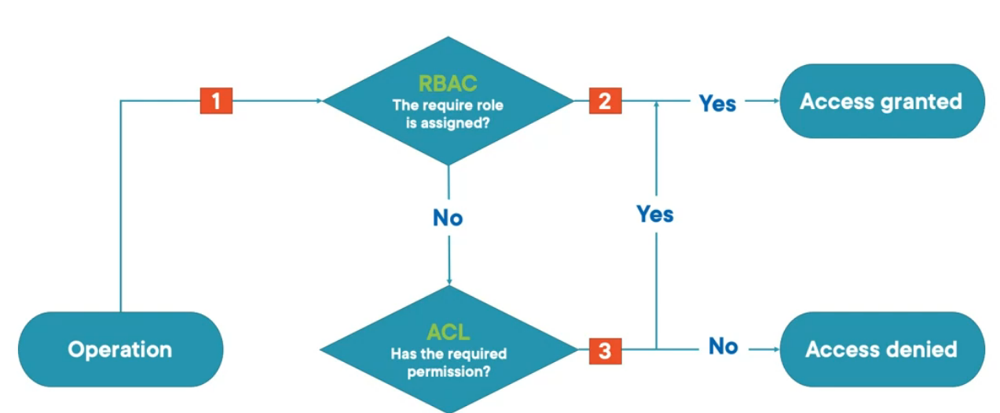

---
tags:
- azure
- cloud
- storage
- security
title: Access Control Methods
---

#### Management Plane

[Role Based Access Control (RBAC)](../azure-security-services/role-based-access-control-rbac.md)  
Coarse grain access to data (the whole storage account or data lake)  

#### Data Plane

**Shared Key Authorization**  
**Shared Access Key (SAS) Authorization**  
When Shared Key and/or SAS Key is used for Authentication RBAC and ACL have no effect  

**Access Control List (ACL)**  
Fine grained access to data (to files and directories)  
Supported for ADLS Storage

[Azure Active Directory (AAD)](../azure-security-services/azure-active-directory/azure-active-directory-aad.md)

---

### Shared Access Signature (SAS)

**User Delegated SAS**  
Uses AAD credential to sign SAS token  
Only supported by Blob Storage  

**Service SAS**  
Scoped to a specific service within the storage account  

**Account SAS**  
Scoped to one more service within the storage account

Service and Account SAS are Ad hoc SAS tokens i.e. the SAS token contains all the fields that describe the type of access that will be provided  
Service SAS (with Stored Access Policy) no need to mention all the fields as they are already defined in the Access Policy

[Grant access to data with shared access signatures (SAS) - Azure Storage | Microsoft Learn](https://learn.microsoft.com/en-us/azure/storage/common/storage-sas-overview)  

### Role Based Access Control (RBAC)

Owner: Has full access to Blob storage container and data  
Contributor: Read, Write and Delete access to Blob containers and blobs  
Reader: Read and list blob container and blobs

### Access Control List (ACL)

**<u>Access ACLs</u>**  
Controls access to an object  
Access ACLs can be applied to files and folders

**<u>Default ACLs</u>**  
An ACL template that determines the ACL for the directory and its child directory  
Files do not have default ACLs  
Changing the default ACL of an parent does not affect the access ACL or default ACL of objects that already exist

 > [!IMPORTANT]
 > * RBAC always is evaluated first and takes precedence over ACL
 > * If RBAC provides the necessary access to a resource then it cannot be blocked by ACL