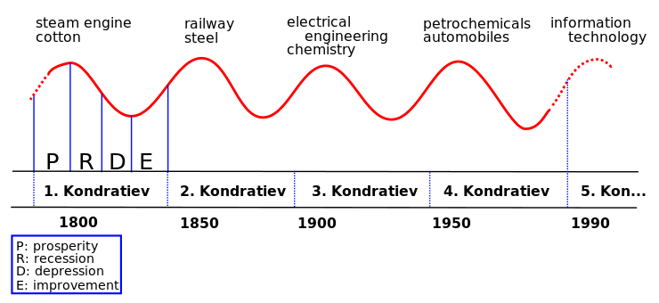

---
tags:
- cloud
title: Innovation Waves
---

Kondratiev waves (also called as Innovation waves) are hypothetical cycle like phenomena in the global world economy  
This concept is closely related to Technology life cycles

Each wave irreversibly changes the society on a global scale  
The latest wave is the **<u>Cloud Wave</u>**  
A common pattern of each wave is the **change in supply and demand**
