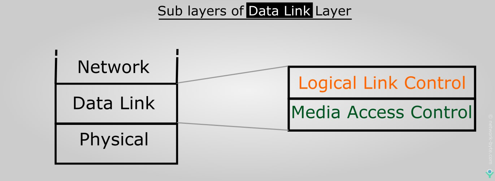

---
tags:
- networking
- data-link
- index
title: Data Link Layer Concepts
---

### Table of Content

* [Ethernet](ethernet.md)
	* [CSMA-CD](csma-cd.md)
* [MAC (Media Access Control) Address](mac-media-access-control-address.md)
* [ARP (Address Resolution Protocol)](arp-address-resolution-protocol.md)
* **Devices**
	* [Switch](../../network-infrastructure/switch/switch.md)
		* [Switch MAC Address Learning](../../network-infrastructure/switch/switch-mac-address-learning.md)
		* [Types of Switch](../../network-infrastructure/switch/types-of-switch.md)
		* [Virtual LANs (VLANs)](virtual-lans-vlans.md)
		* [Spanning Tree Protocol (STP)](spanning-tree-protocol-stp.md)
	- [NIC (Network Interface Card)](../../network-infrastructure/nic-network-interface-card.md)
	- [Bridge](../../network-infrastructure/bridge.md)

---

### Logical Link Control (LLC)
Provides connection services and allows acknowledgement of recipients of messages  
It is the most basic form of Flow Control i.e. controls the amount of data that is sent at once so that the receiver is not overloaded  
Allows devices to make request to receive less data at a time or to replay some data  
Provides basic error control feature allowing receiver to communicate that a data frame was not receiver or it was corrupted  
This error handling is performed using Checksum

### Communication Synchronization

**Isochronous**  
Network devices use a common reference clock source and generate time slots for transmission  
Less overhead as devices know when they can communicate and for how long

**Synchronous**  
Network devices agree on a clocking method to indicate beginning and end of frames and can use control characters

**Asynchronous**  
Network devices use there own internal clocks and use start and stop bits  
No control on when the devices are allowed to communicate

### Devices & Protocols

NIC/ Bridges/ Switches  
MAC Address