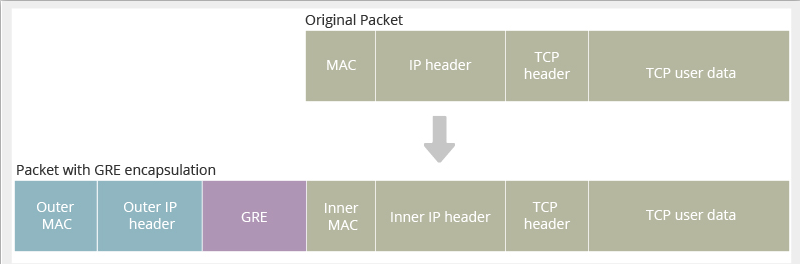

---
tags:
  - networking
  - protocol
  - tunneling
  - security
title: Tunneling Protocols
---

### GRE (General Routing Encapsulation)

Used as a simple and effective way to create a tunnel, over the public internet  
It was developed by Cisco to encapsulate a wide variety of protocols over the Network Layer  
GRE does not provide any encapsulation

### IPsec (Internet Protocol Security)

Used to protect data flows between clients  
Uses TCP for transport  
IPsec provides confidentiality, integrity, authentication and anti-replay protection  
Used heavily by [VPN Server](../../network-security/virtual-private-network-vpn.md)s  

[IPsec Protocol Suite](../../network-protocols/ipsec-protocol-suite.md)

---

[Network (Internet) Layer Concepts](network-layer-concepts.md)