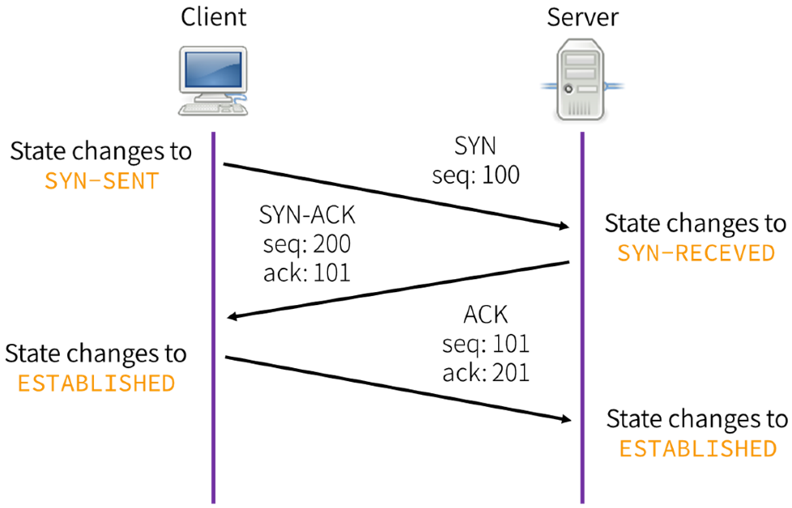

Three Way Handshake is used to share information between the client and server to synchronize the parameters that are going to be used in the connection

### TCP Header 

TCP Header without any of the options is 20 bytes (10 mandatory fields)  
The options are only shared between the client and server during the initial Handshake

#### TCP Flags

| Flags                 | Description                                               |
| --------------------- | --------------------------------------------------------- |
| SYN (Synchronization) | Synchronization request for initialization of connection  |
| ACK (Acknowledgment)  | Acknowledges receipt of packet                            |
| FIN (Finish)          | Teardown virtual connection established between the hosts |
| RST (Reset)           | Send when host receives unexpected data                   |
| PSH (Push)            | Informs to process the data with priority                 |
| URG (Urgent)          | Packets to be processed immediately                       |

The RST flag will be send if client makes a request to a server that is not currently accepting any new connection  
PSH increases the priority of the transmitted data  
URG on the other hand causes packets that are already in the queue will be ignored (The URG packets need to be processed immediately)

---

[TCP (Transmission Control Protocol)](transmission-control-protocol-tcp.md)  
[Transport Layer Concepts](../../../computer-networks/layer-wise-concepts/transport-layer-concepts/transport-layer-concepts.md)