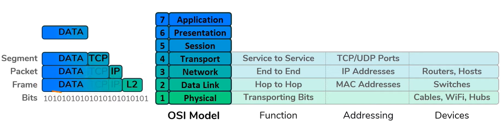

---
tags:
- networking
- model
- concept
title: OSI Model
---

Open Systems Interconnection (OSI) Model was designed in 1977 by ISO  
It is reference model that shows us how data moves through a network, the networks of today use [TCP-IP Model](tcp-ip-model.md)

**Mnemonic**  
Layer Names (From Bottom): Please Do Not Throw Sausage Pizza Away  
Datatype (From Top): Do Some People Fear Birthdays

|         | Layer        | Activity Performed                               |
| ------- | ------------ | ------------------------------------------------ |
| Data    | Application  | Chrome, Firefox, E-Mail Client                   |
| Data    | Presentation | Convert to PC Understandable Format & Encryption |
| Data    | Session      | Maintain connection between two PC               |
| Segment | Transport    | Split data into packets and ordering of packets  |
| Packet  | Network      | Decides the best Route to deliver Data           |
| Frame   | Data Link    | Data Retransmission, Error Checking              |
| Bit     | Physical     | Cable, Optic Fiber                               |

The top 3 layers also called as Host Layers are handles by the host device  
The bottom 4 layers also called as Media Layers are handled by the various networking devices like routers, modems, etc.

### Layer 1: Physical Layer

Defines the physical and electrical medium for communication  
Converts the data received (frames) into bits (1s and 0s)  
Responsible for transporting bits over the network  
[Physical Layer Concepts](../layer-wise-concepts/physical-layer-concepts/physical-layer-concepts.md)

**Transition Modulation**: Data as 1s and 0s is transported by changing the voltage in the wire

### Layer 2: Data Link Layer

Translates messages from network layer into bits for physical layer  
Responsible for checking if the data received from the physical layer is corrupted  
Packets are send to the correct device on this layer using [MAC (Media Access Control) Address](../layer-wise-concepts/data-link-layer-concepts/mac-media-access-control-address.md)
Responsible for Hop to Hop Communication (Device to Device)  
The data at this layer is called a Frame  
[Data Link Layer Concepts](../layer-wise-concepts/data-link-layer-concepts/data-link-layer-concepts.md)

### Layer 3: Network Layer

Responsible for End to End Communication  
Transfers (routes) data using logical addresses  
Uses IP Addresses and routing algorithms to transfer packets over the network  
The source and destination IP Addresses are added into the packet in this layer  
[Network (Internet) Layer Concepts](../layer-wise-concepts/network-layer-concepts/network-internet-layer-concepts.md)

> [!IMPORTANT]  
> Routing is sometimes also called **Switching**, this switching is a Layer 3 process  which is different from switches which is a Layer 2 device

### Layer 4: Transport Layer

Responsible for Service to Service Communication  
[Ports](../layer-wise-concepts/transport-layer-concepts/network-ports.md) are used on this layer to send data to the right application  
Segments (Sender) and reassembles (Receiver) data received from the higher layers  
Segmented data in TCP is called Segments while data in UDP is referred as Datagram  
Connection oriented ([TCP](../layer-wise-concepts/transport-layer-concepts/tcp-transmission-control-protocol.md)) : Reliability: [TCP Three-Way Handshake](../layer-wise-concepts/transport-layer-concepts/tcp-three-way-handshake.md)  
Connectionless ([UDP](../layer-wise-concepts/transport-layer-concepts/udp-user-datagram-protocol.md)) : Efficiency  
[Transport Layer Concepts](../layer-wise-concepts/transport-layer-concepts/transport-layer-concepts.md)

> [!IMPORTANT]
> Data in Layer 4 is called **Segments** when TCP is used and its called **Datagram** when UDP is used

### Layer 5: Session Layer

Ensures data from different application session are kept separate (Prevent Intermingling of data)  
Sets up, manages and tears down sessions between network devices  

Setup Up Session: User credential check and unique number assignment to sessions    
Manage Session: Reestablishment of connection if failure occurs and Acknowledge of receipt  
Tear Down Session: End session when transfer is done or when other party disconnects

**Layer 5 Protocols**  
H.323: Setup, maintain and tear down voice and video connections. These connection use the RTP (Real-time Protocol) for sending data  
NetBIOS: Used to share files over networks

### Layer 6: Presentation Layer

Ensures data from one systems can be understood by the other (**Data Formatting**)  
Provides Character Code Conversion, Data Compression, **Data Encryption**

**Layer 6 Concepts**  
Scripting Languages/ Pictures/ Videos  
TLS/ SSL

### Layer 7: Application Layer

At this layer the user communicates to the computer  
Application here does not mean Browsers, Office, etc. rather the lower level protocols like HTTP, SSH, DNS, etc.  
[Application Layer Protocols](../layer-wise-concepts/application-layer-protocols/application-layer-protocols.md)

**Service Announcement**  
Sending out announcements to other devices on the network to state the service they offer