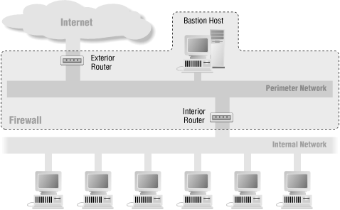

---
tags:
- networking
- device
- security
title: Firewall
---

Protect LAN from malicious activity on the Internet  
Controls the flow of information in and out from the network    
Firewalls can be standalone Network Device or a software on a device (Host-based)    
A firewall can operate on Layer 4 through 7 depending on its type and configuration

#### Screened Subnet (Dual-homed Host)
Acts as a security barrier between external untrusted networks and internal trusted networks using a protected host with security measures like a packet-filtering firewall  
Also called as De-militarized Zone (DMZ)

[Screened subnet - Wikipedia](https://en.wikipedia.org/wiki/Screened_subnet)  
[Screened Subnet Architectures (Building Internet Firewalls, 2nd Edition)](https://docstore.mik.ua/orelly/networking_2ndEd/fire/ch06_03.htm)

#### Host-based Firewall
Windows: Windows Firewall  
MacOS: PF (Packet Filtering) - OSX >= 10 & IPFW (IP Firewall)  
FreeBSD: PF & IPFW  
Linux: iptables

---

### Types of Firewall

#### Packet Filtering Firewall
Checks packet headers for traffic allowance based on IP addresses and ports  
Very basic but fastest  
Cannot stop all types of attacks because of limited inspection capabilities  
Also called <u>Layer 4 Firewall</u>

#### Stateful Firewall
Similar to Packet Filtering Firewall but it also tracks the communication session (inbound and outbound connections)  
Determines the legitimacy of a requested session by monitoring the 3-way handshake (DoS, DDoS Attack)

#### Proxy Firewall
Acts as an intermediary between internal and external connections  

##### Circuit Firewall
Operates at Layer 5 (SOCKS Firewall)  

##### Application Layer Firewall
Filters packets based on an application or service  
Understands certain protocols (FTP, DNS, HTTP, etc.)  
Detects malicious applications and services that tries to bypass it  
Operates at Layer 7

#### Kernel Proxy Firewall
Also called <u>Fifth Generation Firewall</u>  
Has minimal impact on network performance while thoroughly inspecting packets across all layers

#### Next-Generation Firewall (NGFW)
Performs deep Layer 7 packet inspection  
Can look through traffic to detect and prevent attacks  
Connected to the cloud to get the latest threat information  
Can integrate with other security products

#### Unified Threat Management Firewall (UTM)
Provides the ability to conduct multiple security functions in a single appliance  
Includes features of IPS, Antivirus Solutions, VPN, Load Balancer, [DLP](../../cloud-service-providers/gcp/gcp-security-services/data-loss-prevention-dlp.md), etc.
They become a single point of failure for the network

#### Web Application Firewall (WAF)
Focuses on the inspection of HTTP traffic
