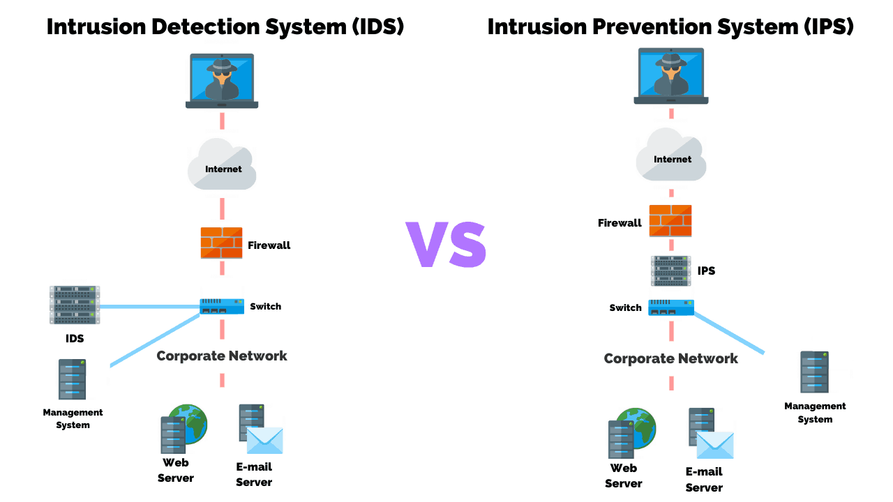

---
tags:
- networking
- security
- device
title: IDS and IPS
---

### Intrusion Detection System
Detect attacks on the network and log and report the incident

#### Types of Alerts
**True Positive**: Malicious activity identified as an attack  
**True Negative**: Legitimate activity detected so no alerts  
**False Positive**: Legitimate activity is detected as an attack  
**False Negative**: Malicious activity is not detected as an attack

### Intrusion Prevention System  
Detect attacks on network and actively try and prevent it  
Makes changes to the ACL or closes services, sessions or ports

[Intrusion Detection VS Prevention Systems: What's The Difference?](https://purplesec.us/intrusion-detection-vs-intrusion-prevention-systems/)

### IDS/IPS Types

##### Host-based
Called as HIDS/HIPS  
Installed on servers and workstations  
Detect attacks on the hosts not on the network  
Will impact the hosts performance

##### Network-based
Called as NIDS/NIPS  
Standalone device on the network  
It is configured on a SPAN or mirrored port of the backbone switch  
Uses sensors on the network devices to report on attacks  
Cant monitor traffic of individual hosts

##### Wireless
Called as WIDS/WIPS  
Attempts to detect DOS attacks on the wireless network

---

### Monitoring Techniques

#### Signature-based Detection
Looks for a specific string of bytes to trigger an alert  
Can only detect attacks based on the patterns present in its database

##### Pattern-matching
Specific pattern of steps  
Commonly used on NIDS, WIDS

##### Stateful-matching
Compares against known system baseline  
Commonly used on HIDS

#### Anomaly-based Detection
Also called Behavior-based Detection  
Analyze current network traffic against established baseline traffic and alerts if outside the statistical average

##### Statistical
##### Protocol
##### Traffic
##### Rule/Heuristic
##### Application-based
