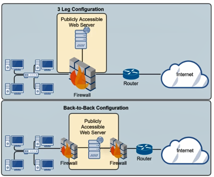
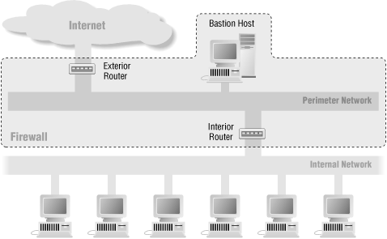

---
tags:
  - networking
  - security
title: Screened Subnet
---

Also called <u>De-militarized Zone (DMZ)</u>   
Devices place in the Screened Subnet as called <u>Dual-homed Host</u>

Type of network that is used to be separate the Internet from the organizations network  
Untrusted users outside an organizations LAN can access services within the DMZ  

Acts as a security barrier between external untrusted networks and internal trusted networks using a protected host with security measures like a packet-filtering firewall  

Two types of common configuration: **Leg Configuration** & **Back-to-Back Configuration**

[Screened subnet - Wikipedia](https://en.wikipedia.org/wiki/Screened_subnet)  
[Screened Subnet Architectures (Building Internet Firewalls, 2nd Edition)](https://docstore.mik.ua/orelly/networking_2ndEd/fire/ch06_03.htm)
