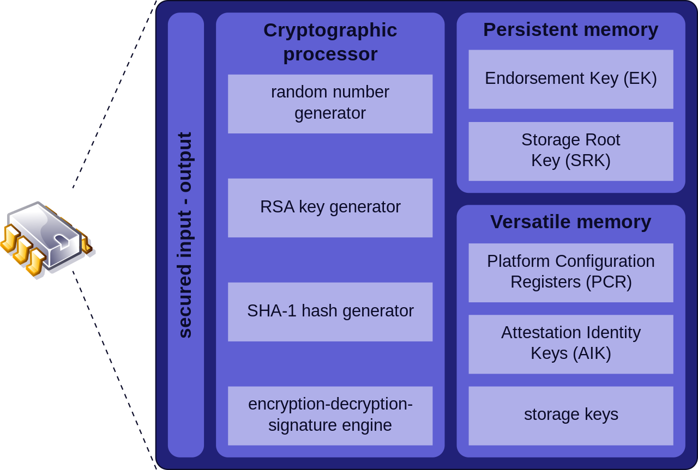

---
tags:
- security
- device
title: Encryption Tools & Techniques
---

### Root of Trust (RoT)
A cryptographic module embedded inside within a computer system that can endorse trusted execution and attest to the boot settings and metrics  
It scans the boot metrics and OS files to verify their signature, which we can then use to sign a digital report

#### Trusted Platform Module (TPM)  
A specification for hardware-based storage of digital certificates, keys, hashed passwords and other user and platform identification information

#### Hardware Security Module (HSM)
An appliance for generating and storing cryptographic keys that is less susceptible to tampering and insider threats than software-based storage

**Anti-Tamper**  
Methods that make it difficult for an attacker to alter unauthorized execution of software  
Can be enforced using Field Programmable Gate Array (FPGA) or a Physically Unclonable Function (PUF)  
These mechanisms zero out the cryptographic keys which in turn deletes the data on the system if any tampering is detected

### Key Management System
Integrated approach for generating, distributing and managing cryptographic keys for devices and applications
