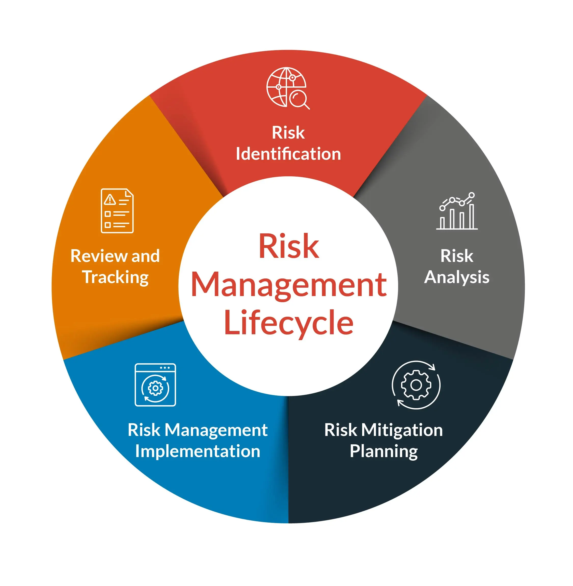

#### Risk Management
Process of finding ways to minimize the likelihood of an undesirable outcome from occurring so that the desired outcomes can be reached  

[Threats and Vulnerabilities](../general-concepts/threats-and-vulnerabilities.md)

Risk = Threat \* Vulnerability (or Likelihood)  
Risk = Threat \* Vulnerability \* Impact  

Total Risk = Threat * Vulnerability \* Asset Value  
Residual Risk = Total Risk - Countermeasures

#### Risk Management Lifecycle

* [Risk Identification](../risk-management/risk-identification.md)  
	* [Risk Appetite](../risk-management/risk-appetite.md)
* [Risk Assessment](../risk-management/risk-analysis.md)  
	* [Risk Register](../risk-management/risk-register.md)
* [Risk Response and Mitigation](../risk-management/risk-management-strategies.md)   
* [Risk and Control Monitoring and Reporting](../risk-management/risk-monitoring.md)

**Due Diligence**: Doing the research before implementation  
**Due Care**: Implementation