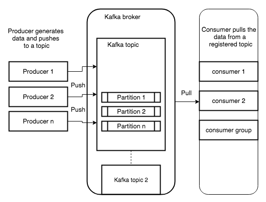

---
tags:
- analytics
- kafka
title: Kafka Architecture
---

* Message: A single data record passed to Kafka
* Topic: Category or feed name to which messages are written.
* Producer: Publishes messages to a topic
* Consumer: Subscribes to a topic and consumes the messages
* Partition: Topic is broken down into Ordered commit log to which messages are written
* Broker: Kafka Server (Kafka cluster of brokers)

