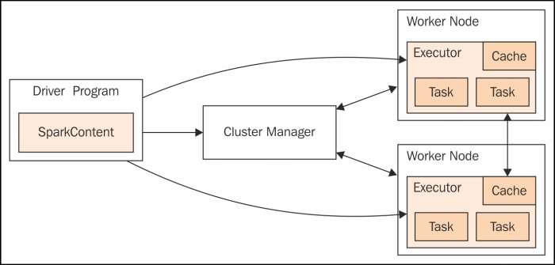

---
tags:
- analytics
- spark
title: Spark Clusters
---

A cluster is a collection of one or more VMs that work together

### Master Node/ Name Node

Coordination (Driver Program)

### Worker Node/ Data Node

Performs actual processing  
Workers have Executor which are responsible for running the task  
Each Worker node can have multiple executors (Depends on core/ memory configuration)  
One worker can be assigned more than one task for execution  
The tasks and processed results are stored in workers memory