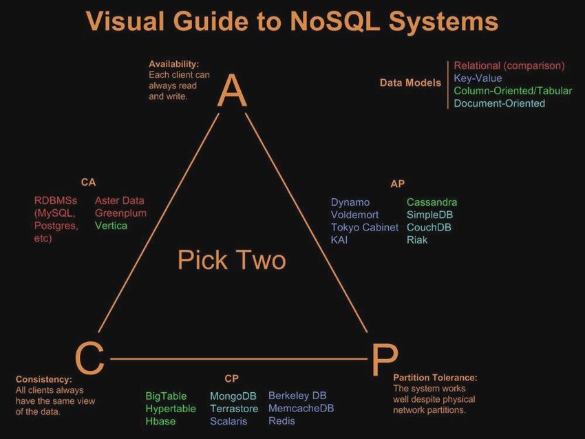

---
tags:
- database
- concept
- nosql
title: Database Theorems
---

ACID: Atomic, Consistent, Isolation, Durability  
BASE: Basically Available, Soft State, Eventual Consistency  
CAP: Consistency, Availability, Partition Tolerance  
[A plain English introduction to CAP theorem « Kaushik Sathupadi](http://ksat.me/a-plain-english-introduction-to-cap-theorem)

**<u>PACELC Theorem</u>**  
If Partition Tolerance then compromise between Availability and Consistency  
else compromise between Latency and Consistency  
[PACELC theorem - Wikipedia](https://en.wikipedia.org/wiki/PACELC_theorem)