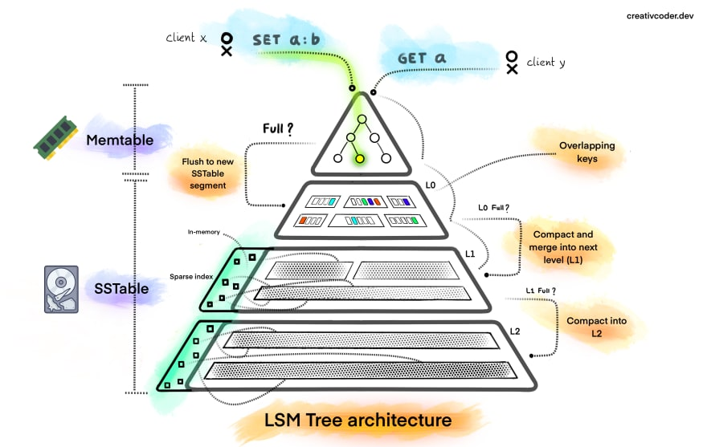

---
tags:
- database
- nosql
- data-structure
title: Log Structure Merge (LSM) Tree
---

**<u>In-memory Storage</u>**  
Incoming write operators are batched and saved in memory in a structure called memtable  
The data in the memtable is ordered using the Object Key is is usually implemented as a Binary Tree

After the Memtable reaches a certain size it is sorted & flushed to disk as a Immutable Sorted String Table (SSTable)  
The data in SSTable is stored are sorted Key Value pairs. The write operations are all sequential in nature and are vey fast  
The new SSTable becomes the most recent segment of the LSM Table  
As new data is added new SSTables are created for storing the data

**<u>Updating Data</u>**  
As SSTables are Immutable when the value of an key is changes the value is not changes in the SSTable that contains that key but rather a new entry is added into the newest  SSTable and supersede any entries for that key

**<u>Delete Data</u>**  
To perform a delete operation an tombstone marker is added for that key into the latest SSTable  
On read when the tombstone is encountered the Database Engine understands that the key needs to be skipped

When we perform an data read operation the data in the memtable is queried first and then each SSTable in the order in which they where created until the required data is found

**<u>Merging and Compaction</u>**  
As more and more data is added and update and delete operations are performed the amount of space that is occupied by outdated data keeps increasing  
So solve this issue there is an periodic merging and compaction process that is running in the background

There are two main types of compacting operations that are used by NoSQL databases  
Size Tiering: Write Optimized  
Level Tiering: Read Optimized

With Compaction the aim is to keep the number of SSTables manageable  
Each Level that is created by the merge operation is larger than the previous layer  
Compaction is an very IO heavy operation and can greatly slow down the DB if not tuned properly

Most production databases maintain a Summary Table and [Bloom Filter](../../software-engineering/data-structures-and-algorithms/data-structures/bloom-filter.md) to reduce the no. of random IO required to find data

[What is a LSM Tree? - DEV Community 👩‍💻👨‍💻](https://dev.to/creativcoder/what-is-a-lsm-tree-3d75)

---

[Database Engineering](../database-engineering.md)