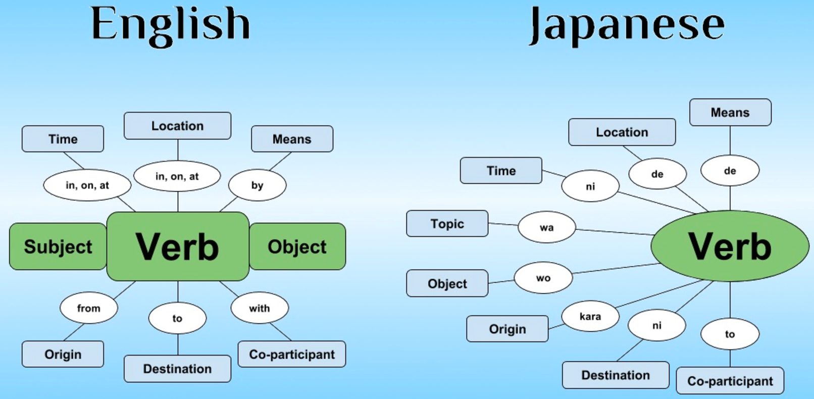

---
tags:
- language
- japanese
- grammer
title: Japanese Grammar
---

## Japanese Grammer

Japanese follows S (Subject) O (Object) V (Verb) structure

[Japanese Sentence Structure: The Ultimate Beginner's Guide - 80/20 Japanese](https://8020japanese.com/japanese-sentence-structure/)

---

### Table of Content

* [X wa Y desu](x-wa-y-desu.md)

---

[Japanese](../japanese.md)