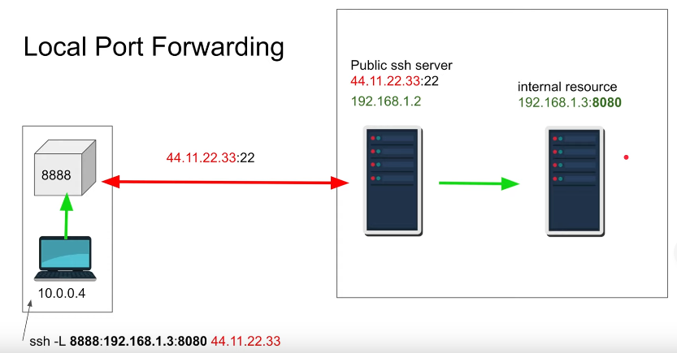
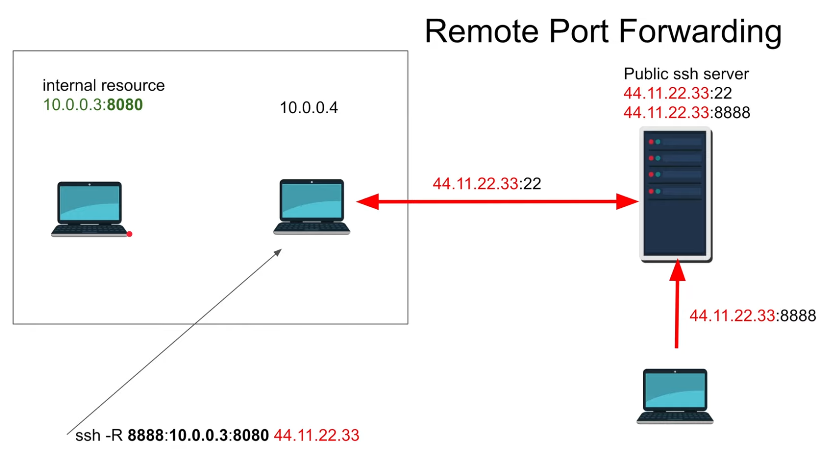

---
tags:
- os
- linux
- command
title: SSH Port Forwarding
---

### Local Port Forwarding

I want to access remote resources that I can't access  
The SSH server should have access to the resource that we are trying to access



````bash
ssh -L <local-port>:<resource-to-access> <ssh-server>
````

### Remote Port Forwarding

I want people to access local resources that they can't have access



````bash
ssh -R <local-port>:<resource-to-access> <ssh-server>
````

 > [!NOTE]
 > For Remote Port forwarding the ssh server config `/etc/ssh/sshd_config` should have the following property
 > `GatewayPorts yes`