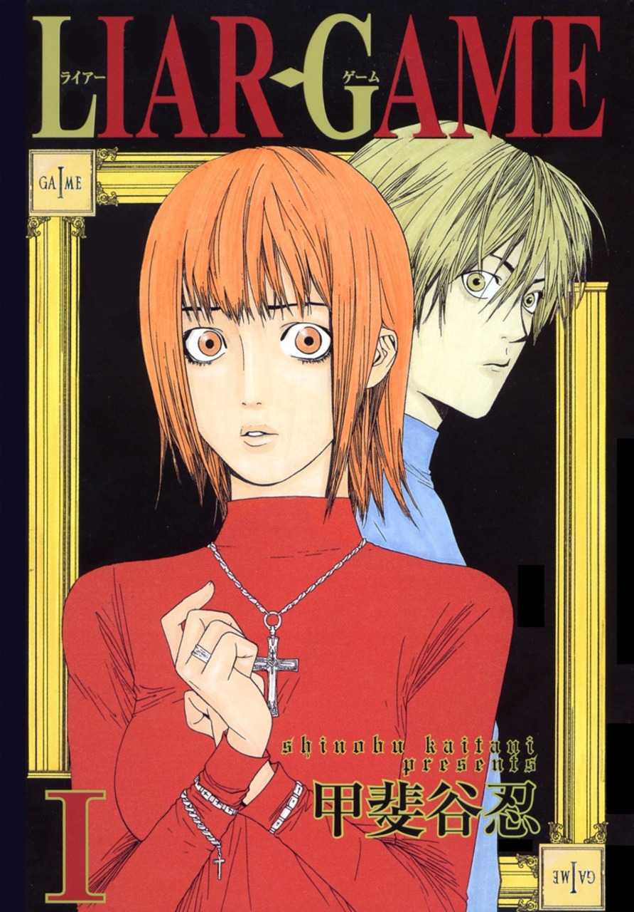

---
cssclasses:
- numbered-rows
- wide-table
tags:
- list
- book
title: Manga List
---

| No. | Cover | Name | Author | Genre | MyAnimeList | Rating | Status |
| :--: | :--: | :--: | :--: | :--: | :--: | ---- | :--: |
|  |  | Chainsaw Man | Taksuki Fujimoto | Fiction, Action, Dark Fantasy | [Link](https://myanimelist.net/manga/116778/Chainsaw_Man) | ⭐⭐⭐ | #ongoing |
|  |  | Uzumaki | Junji Ito | Fiction, Horror, Supernatural, Psychological | [Link](https://myanimelist.net/manga/436/Uzumaki) | ⭐⭐⭐⭐ | #completed |
|  |  | Tomie | Junji Ito | Fiction, Horror, Supernatural | [Link](https://myanimelist.net/manga/912/Tomie) | ⭐⭐⭐ | #completed |
|  |  | BLAME! | Nihei Tsutomu | Fiction, Action, Psychological, Sci-Fi | [Link](https://myanimelist.net/manga/149/Blame) | ⭐⭐⭐⭐ | #completed |
|  |  | Liar Game | Kaitani Shinobu | Fiction, Psychological, Drama | [Link](https://myanimelist.net/manga/1649/Liar_Game) | ⭐⭐ | #completed |
|  |  | Happiness | Shūzō Oshimi | Fiction, Supernatural, Dark Fantasy | [Link](https://myanimelist.net/manga/85173/Happiness) | ⭐⭐⭐ | #completed |
|  |  | 20th Century Boys | Naoki Urasawa | Fiction, Sci-Fi, Thriller, Psychological | [Link](https://myanimelist.net/manga/3/20th_Century_Boys) | ⭐⭐⭐⭐ | #completed |
|  |  | Dorohedoro | Hayashida Q. | Fiction, Action, Fantasy | [Link](https://myanimelist.net/manga/1133/Dorohedoro) | ⭐⭐⭐⭐⭐ | #completed |
|  |  | The Sandman | Neil Gaiman | Fiction, Dark Fantasy, Horror | [Link](https://www.goodreads.com/book/show/23753.The_Absolute_Sandman) | ⭐⭐⭐⭐⭐ | #completed |
|  |  | The Horizon | Ji-Hoon Jeong | Fiction, Adventure, Drama | [Link](https://myanimelist.net/manga/125036/The_Horizon) | ⭐⭐⭐⭐⭐ | #completed |
|  |  | Akumetsu | Yoshiaki Tabata | Fiction, Drama, Action, Suspense | [Link](https://myanimelist.net/manga/1101/Akumetsu) | ⭐⭐⭐ | #completed |
|  |  | Smashed | Junji Ito | Fiction, Horror, Supernatural |  | ⭐⭐⭐ | #completed |
|  |  | Homunculus | Hideo Yamamoto | Fiction, Drama, Mystery, Supernatural | [Link](https://myanimelist.net/manga/936/Homunculus) | ⭐⭐⭐ | #completed |
|  |  | Pluto | Naoki Urasawa | Fiction, Action, Mystery, Si-Fi | [Link](https://myanimelist.net/manga/745/Pluto) | ⭐⭐⭐⭐ | #completed |
|  |  | Helck | Nanaki Nanao | Fiction, Action, Fantasy | [Link](https://myanimelist.net/manga/77637/Helck) | ⭐⭐⭐⭐ | #completed |
|  |  | Holyland | Kouji Mori | Fiction, Action, Psychological | [Link](https://myanimelist.net/manga/3285/Holyland) |  | #reading  |

[Read & Watch List](../read-and-watch-list.md)
