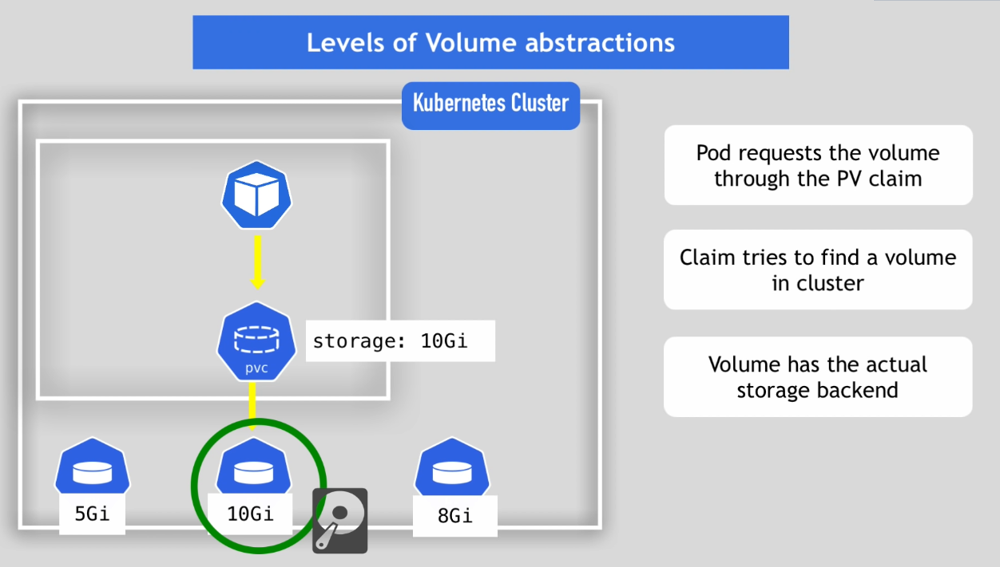
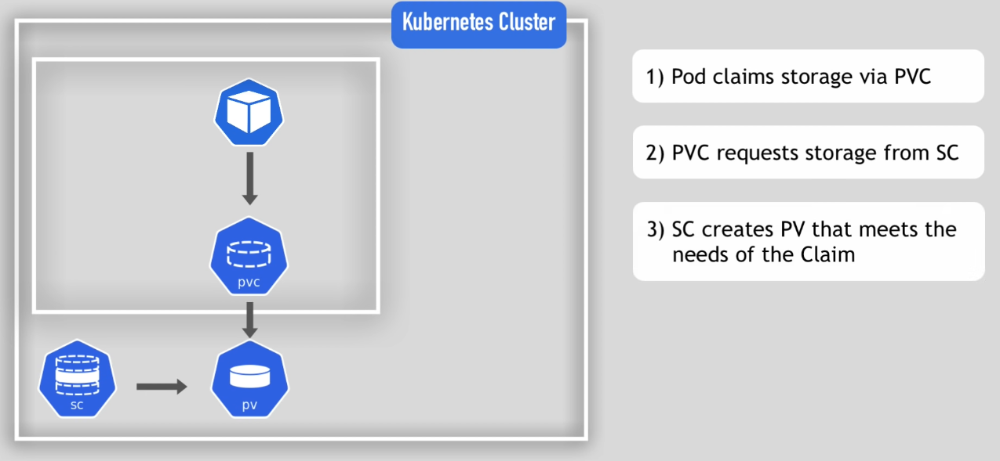

---
tags:
- kubernetes
- container
- devops
- orchestration
title: Kubernetes Volumes
---

Volumes in Kubernetes need to meet three criteria's:

* Outlives the lifecycle of the Pods
* It should not be tied to a Cluster Node
* Should be able to survive an Cluster Crash

---

### Persistent Volumes

Allows to attach storage to the cluster/ Pod  
Storage can be either Local (Node HDD) or External (Cloud Storage/ NFS)  
Creating volume in K8s does not provision **actual** storage space (It is only metadata)  
The actual storage needs to be managed and created separately

Volumes are tied to the lifecycle of the Pod  
All the containers in a Pod can access the volume  
They are not namespaced and is available to all resources on the cluster

Local Volumes : Will be tied to a specific node and cannot survive a cluster crash  
For DB data it is always recommended to use remote storage

### Persistent Volume Claim (PVC)

For a Pod (application) to use the Volume it needs to **Claim** the volume  
In the PVC config the characteristics of the Volume that is required is specified and the Volume that matches the PVC is selected

In the Pod config the PVC to be used needs to be specified  
PVC has to be present in the same namespace as the Pod

Once the Pod has access to the Volume it needs to be mounted to the Pod in order for it to be accessible

### Storage Class

Allows to provision Persistent Storage Dynamically when PVC claims it  
The Storage Backend is defined using the **provider** attribute

