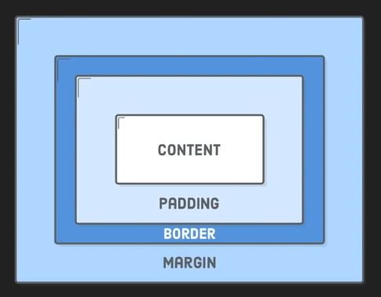

---
tags:
- programming
- css
- webdev
title: CSS Box Model
---

**Padding**: Spacing between the content and the border  
**Border**: Divider between the padding and the margin  
**Margin**: Space between the border and all other content

---

**<u>References</u>**:

* [box-sizing: border-box explained - YouTube](https://www.youtube.com/watch?v=WlGQdgy-M6w)
* [Inheriting box-sizing Probably Slightly Better Best-Practice | CSS-Tricks - CSS-Tricks](https://css-tricks.com/inheriting-box-sizing-probably-slightly-better-best-practice/)