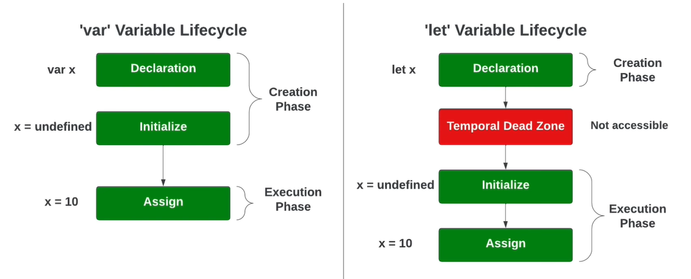
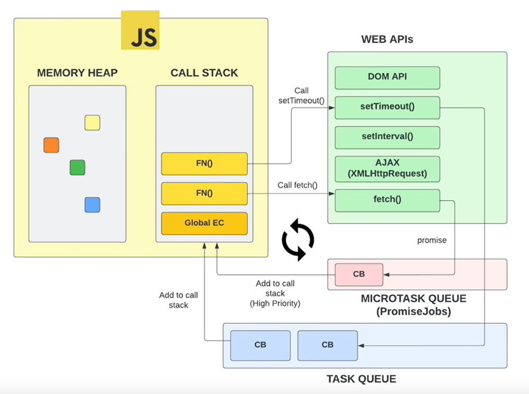

---
tags:
- programming
- javascript
- webdev
title: JS - Under the Hood
---

Single threaded language. Sequential flow of statements  
Has support for async features using Web APIs  
Each thread has an Call Stack and Memory Heap associated with it

---

### Execution Context

Global Execution Context is always at the bottom of the call stack  
It is created as soon as the execution of the code starts

For each function call a new execution context is created and pushed on top of the stack  
The Execution Context consists of the currently running code and everything that helps in the execution of the code

---

### Execution Context Creation

<u>Memory Creation Stage</u>

* Creates the global object (browser : window & Node.js : global)
* Creates the "this" object and binds it to the global object
* Sets up Heap for storing variables and function references
	* For Functions the entire code is stored in memory
	* For function the values are initially set to **undefined** (Important to understand hoisting)

<u>Execution Phase</u>

* Execute code line by line (Function code is skipped as its already saved in memory)
* When new **function call** encountered creates a new execution context

---

### Hoisting

The process whereby the interpreter appears to move the declaration of functions, variables or classes to the top of their scope, prior to execution of the code  
In reality this is not the case its just the way Execution context in JavaScript works

When "let" and "const" is used the variables are not declared in the global scope and hence cannot be accessed using logged before declaration

---

### Web API and Event Loop

Web API features are not part of JS they are provided on top of JS by browsers

When ever we make use of an callback that function call is put on the Task Queue  
Some callbacks functions like Browser Observers and Promises have a higher priority and are instead added into the Micro Task Queue

When the Call Stack is empty the Micro Task Queue is checked next and all the tasks in this queue is executed then the Task Queue is checked and tasks in this queue is executed

[The JavaScript Event Loop: Explained | by Ayush Verma | Towards Dev](https://towardsdev.com/event-loop-in-javascript-672c07618dc9)