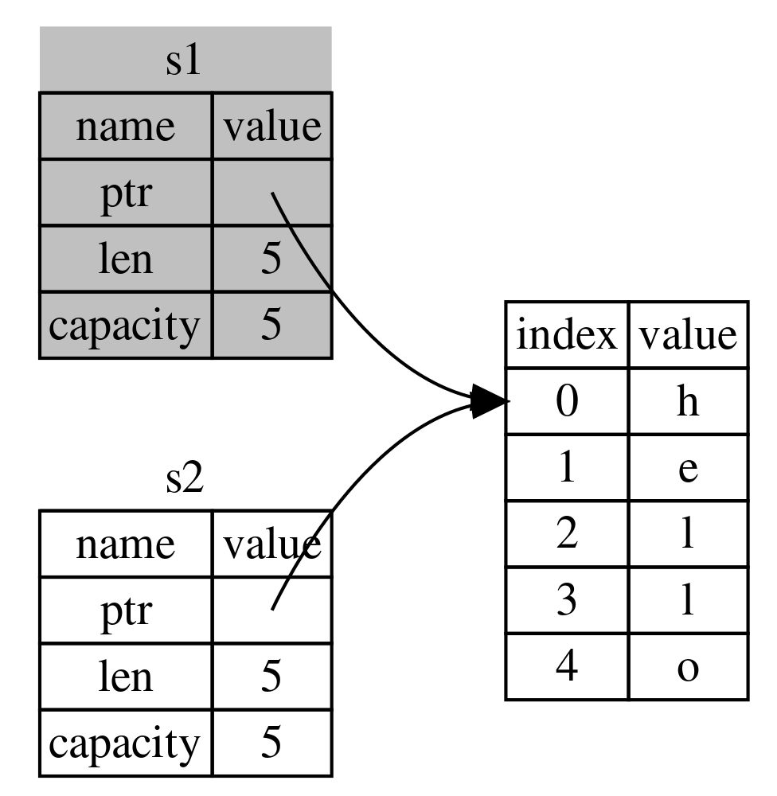
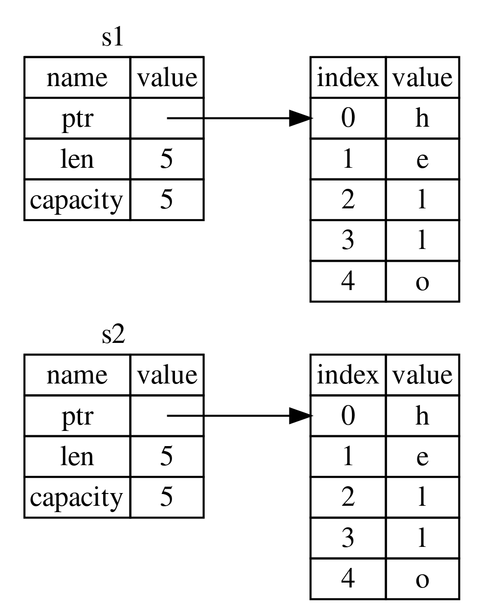
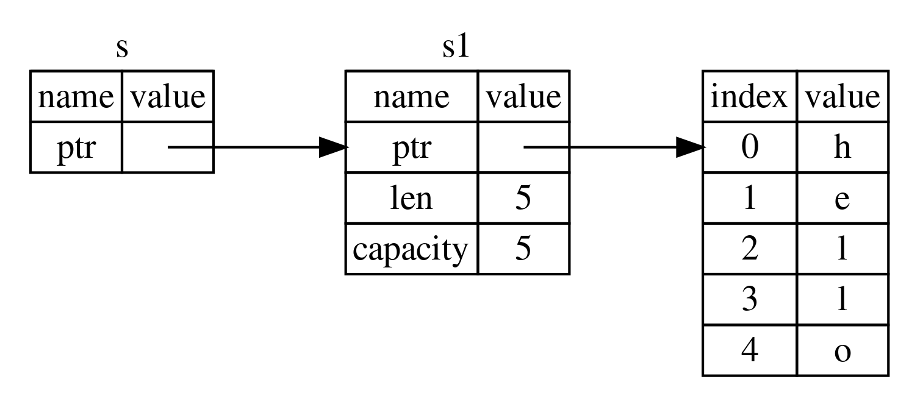

---
tags:
  - rust
  - programming
  - memory
  - management
title: Rust Ownership Model
---

### Ownership Rules

1. Each value in Rust has an variable. This variable is called Owner  
2. There can only be one owner at a time (Value cannot be owned by multiple variables)  
3. When the owner goes out of scope the variable is also dropped

### Ownership

In languages like C to allocate memory on the Heap we have to use the `new` keyword and to delete the memory we need to use the `delete` keyword  

```rust
{
	let name = String::from("Hello World");
	// From line 2 variable 'name' is considered valid
} // 'name' is deallocated
```

Allocation and Deallocation of memory is performed automatically in Rust  
Similar to RAII pattern followed in C++

```rust
let string1 = String::from("Hello World");
let string2 = string1;
println!("{}", string1);
```

In other languages the variable string2 would become a shallow copy i.e. a pointer pointing to the same memory location as variable string1  

In Rust the value of string1 is copied to string2 (Rule 2) and then string1 is invalidated  
Since string1 is invalidated unlike in shallow copy Rust calls this operation as **Move**  
This causes the ownership of the variable to be passed to string2 from string1



```rust
let string2 = string1.clone();
println!("{}", string1);
```

The `clone()` method has to be used to perform the more expensive (deep) copy operation  



The scalar datatypes implement a Trait called Copy which allows them to be copied automatically

Move even occurs when a Compound Datatype is passed/ returned from a function

```rust
fn main() {
    let string1 = gives_ownership();
    
    let string2 = String::from("Hello Hello World");
    let string3 = takes_and_gives_ownership(string2);

	// Printing String2 will result in Panic
    println!("String1: {}\nString3: {}", string1, string3);
}

fn gives_ownership() -> String {
    let local_string = String::from("Hello World");
    local_string
}

fn takes_and_gives_ownership(input_string: String) -> String {
    input_string
}

```

### Borrowing Rules

1. At any given time, you can either have one mutable reference or any number of immutable reference
2. References must always be valid (Invalid references result in compilation error)

### Borrowing

Instead of assigning the ownership of a value to different variables we can pass the reference to the value to another variable (borrow the value from owner)  
Since the variable that borrowed the value does not own the value when it goes out of scope the value is not cleared



```rust
fn main() {
    let string1 = String::from("My Long String");
    let string_length = calculate_length(&string1);
    println!("Length of String: '{}' = {}", string1, string_length);
}

fn calculate_length(input_string: &String) -> usize {
    let string_length = input_string.len();
    string_length
}
```

References are immutable by default. We cannot use them to modify the data  
To mutate data using references we must create a mutable reference (`&mut var1`)  

In a given scope there can only be a single mutable reference to specific data

```rust
// Below code will result in Panic (Two mutable reference to same data)
let mut s1 = String::from("Hello");
let ref1 = &mut s1;
let ref2 = &mut s1;

println!("Ref1: {}\nRef2: {}", ref1, ref2);
```

If we create an immutable reference we cannot have a mutable reference to the same data as long as the immutable reference is in scope (Reverse is also true)

```rust
// Below code is valid (Will compile properly)
let mut s1 = String::from("Hello");
let ref1 = &s1;
let ref2 = &s1;
println!("Ref1: {}\nRef2: {}", ref1, ref2);

let ref3 = &mut s1;
println!("Mutable Reference: {}", ref3);
```

We can borrow from an invalid/non-existent owner (Owner has been dereferenced)

```rust
fn main() {
    let reference_to_nothing = dangle();
}

fn dangle() -> &String {
    let string = String::from("Hello");
    &string
}
```