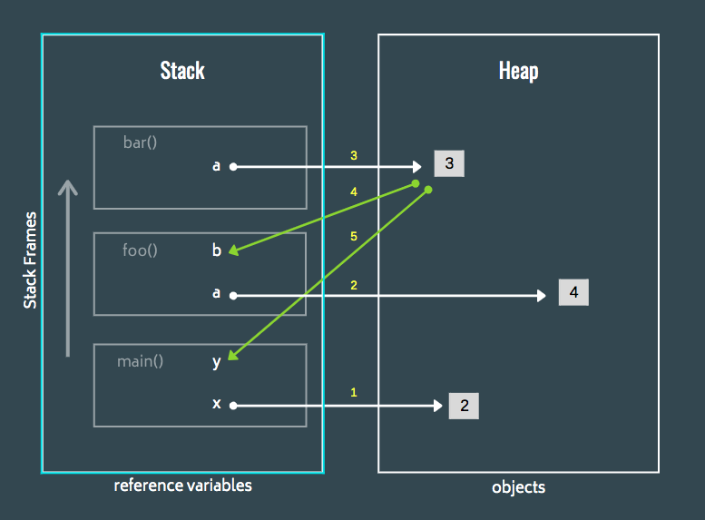

---
tags:
  - programming
  - software
  - management
  - memory
title: Stack and Heap Memory
---

The Stack memory is used to hold value type objects  
Stack Memory is of fixed size it cannot grow and shrink

Heap Size is dynamic and can grow and shrink as required  
The data that is stored in the Heap can also be dynamic in size (Arrays, Lists, etc.)

The Heap is used to hold the **actual** value of the reference type objects  
The reference variable is stored in the stack  

 > [!important]
 > * Memory Heap is not the same as the Data Structure Heap
 > * Memory Heap is free space reserved for storing values that are required by the program

Accessing and saving data on the Stack in faster compared to Heap

Each function in the program gets its own Stack Frame in the stack memory  
Each frame stores some metadata along with it which helps to identify the scope of the variables (Local and Global variables)  
Size of Stack Frame is calculated at Compile Time

Classes are created in the Heap memory and the methods of the class are created on the Stack memory from where they interact with the object in the Heap  
Stack Frame is removed from memory as soon as the function/ method is returned

---